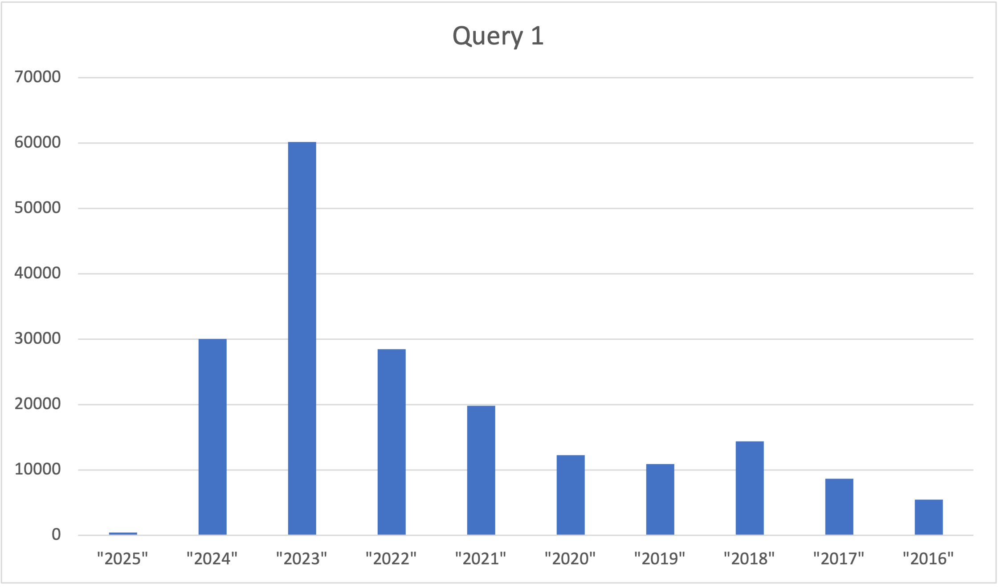

# Proyecto_Final_BD
Subida del proyecto final elaborado en DataGrip 

## Contenidos
1. [Proyecto](#proyecto)
   1. [Integrantes del equipo](#integrantes-del-equipo)
   1. [Introducción](#introducción)
   1. [Problema a estudiar](#problema-a-estudiar)
   1. [Descripción de los datos](#descripción-de-los-datos)
1. [Configuración](#configuración)
   1. [DataGrip y requerimientos](#datagrip-y-requerimientos)
   1. [Base de datos](#base-de-datos)
1. [Estructura del proyecto](#estructura-del-proyecto)

## Proyecto

### Integrantes del equipo:
* [Carlos Gerardo Castillo Campos](https://github.com/CharlsB73)
* [Pablo Ernesto Gómez](https://github.com/Pabo-0)


### Introducción
Durante el análisis y procesamiento de la base de datos de vehículos eléctricos en el estado de Washington, surgen varios desafíos que requieren atención para garantizar la calidad y utilidad del conjunto de datos. En primer lugar, la estructura actual de los datos presenta redundancias significativas, como registros duplicados de fabricantes o modelos debido a inconsistencias en la entrada de datos. Esto complica la agrupación y el análisis, haciendo necesario implementar un proceso de normalización que elimine estas redundancias y reorganice las tablas para cumplir con las formas normales, asegurando que cada atributo dependa exclusivamente de su clave principal.
Otro problema crítico es la presencia de valores faltantes en atributos importantes como el tipo de carga o la ubicación. Estos vacíos en los datos pueden sesgar el análisis, dificultando la identificación de patrones en la adopción de vehículos eléctricos. Además, es necesario manejar datos erróneos, como ubicaciones mal georreferenciadas o valores inconsistentes en el tipo de carga. Por ejemplo, se han detectado registros donde el mismo modelo de vehículo aparece asociado a diferentes tipos de carga, lo que afecta la confiabilidad del análisis.
Finalmente, es esencial diseñar un esquema que facilite la exploración de factores clave en la adopción de vehículos eléctricos. Esto incluye analizar las tendencias de registro por fabricante y modelo, la distribución geográfica de los vehículos y la relación entre la infraestructura de carga y la densidad de registros. Estos problemas forman el núcleo del proyecto y su resolución será fundamental para extraer conclusiones útiles que puedan informar decisiones sobre la promoción de esta tecnología en el estado.
El estudio de una base de datos relacionada con vehículos eléctricos en el estado de Washington también plantea importantes implicaciones éticas que deben ser consideradas. Dado que los datos pueden incluir información sensible, como ubicaciones geográficas específicas o detalles sobre usuarios particulares, es fundamental garantizar la protección de la privacidad y la seguridad de los datos recopilados. Esto implica adherirse a normativas como el Reglamento General de Protección de Datos (GDPR) o leyes locales de privacidad, evitando cualquier uso indebido o exposición de datos personales. Además, el análisis debe ser transparente y responsable, evitando sesgos que puedan derivar en decisiones perjudiciales para ciertos grupos o regiones. Por ejemplo, al identificar factores clave en la adopción de vehículos eléctricos, es crucial no discriminar contra comunidades con menor acceso a recursos o infraestructura, garantizando que los hallazgos se utilicen para promover la equidad y el desarrollo inclusivo de esta tecnología.

### Problema a estudiar

Durante el análisis y procesamiento de la base de datos de vehículos eléctricos en el estado de Washington, surgen varios desafíos que requieren atención para garantizar la calidad y utilidad del conjunto de datos. En primer lugar, la estructura actual de los datos presenta redundancias significativas, como registros duplicados de fabricantes o modelos debido a inconsistencias en la entrada de datos. Esto complica la agrupación y el análisis, haciendo necesario implementar un proceso de normalización que elimine estas redundancias y reorganice las tablas para cumplir con las formas normales, asegurando que cada atributo dependa exclusivamente de su clave principal.
Otro problema crítico es la presencia de valores faltantes en atributos importantes como el tipo de carga o la ubicación. Estos vacíos en los datos pueden sesgar el análisis, dificultando la identificación de patrones en la adopción de vehículos eléctricos. Además, es necesario manejar datos erróneos, como ubicaciones mal georreferenciadas o valores inconsistentes en el tipo de carga. Por ejemplo, se han detectado registros donde el mismo modelo de vehículo aparece asociado a diferentes tipos de carga, lo que afecta la confiabilidad del análisis.
Finalmente, es esencial diseñar un esquema que facilite la exploración de factores clave en la adopción de vehículos eléctricos. Esto incluye analizar las tendencias de registro por fabricante y modelo, la distribución geográfica de los vehículos y la relación entre la infraestructura de carga y la densidad de registros. Estos problemas forman el núcleo del proyecto y su resolución será fundamental para extraer conclusiones útiles que puedan informar decisiones sobre la promoción de esta tecnología en el estado.
El estudio de una base de datos relacionada con vehículos eléctricos en el estado de Washington también plantea importantes implicaciones éticas que deben ser consideradas. Dado que los datos pueden incluir información sensible, como ubicaciones geográficas específicas o detalles sobre usuarios particulares, es fundamental garantizar la protección de la privacidad y la seguridad de los datos recopilados. Esto implica adherirse a normativas como el Reglamento General de Protección de Datos (GDPR) o leyes locales de privacidad, evitando cualquier uso indebido o exposición de datos personales. Además, el análisis debe ser transparente y responsable, evitando sesgos que puedan derivar en decisiones perjudiciales para ciertos grupos o regiones. Por ejemplo, al identificar factores clave en la adopción de vehículos eléctricos, es crucial no discriminar contra comunidades con menor acceso a recursos o infraestructura, garantizando que los hallazgos se utilicen para promover la equidad y el desarrollo inclusivo de esta tecnología.


### Descripción de los datos

#### Diseño Original
La base de datos original cuenta con un total de 17 atributos y 205,440 tuplas. Esta fue extraída de https://catalog.data.gov/dataset/electric-vehicle-population-data. Los datos se pueden descargar en [este link](https://drive.google.com/file/d/1x6AvLlwbXijpxsOf5u0_nZI2Tv-gz1vz/view?usp=share_link).

#### Atributos
- VIN (0-10): Identificador único del vehículo reducido a solo 10 dígitos. Este puede identificar a todas las tuplas individualmente de manera única.

- Country: Región geográfica de un estado (condado) en la que reside el propietario del vehículo. Los vehículos matriculados en el estado de Washington pueden estar ubicados en otro estado.

- City:  La ciudad en la que reside el propietario registrado.

- State: Región geográfica del estado asociado con el registro. Esta dirección puede estar ubicada en un estado diferente de Washington.

- Postal Code: Código postal de 5 dígitos en el que reside el propietario registrado. Puede haber un propietario con el mismo código postal y vehículos diferentes. 

- Model Year: Año del modelo del vehículo, determinado al decodificar el VIN.

- Make: Fabricante del vehículo determinado al decodificar el VIN.

- Model: Modelo del vehículo determinado al decodificar el VIN.

- Electric Vehicle Type: Distingue entre un vehículo de batería totalmente eléctrica (BEV) y un vehículo eléctrico híbrido enchufable (PHEV).

- Clean Alternative Fuel Vehicle (CAFV) Eligibility: Elegibilidad del vehículo para ser considerado de combustible alternativo limpio.

- Electric Range: La autonomía eléctrica medida en millas. En caso de que no se haya investigado aún la autonomía esta será 0.

- Base MSRP: Precio de venta sugerido, en caso de que este no tenga es 0.

- Legislative District: La sección específica del estado de Washington en la que reside el propietario del vehículo. Un mismo distrito puede estar asignado a diferentes condados y ciudades. Solo se registrará un distrito si el auto está registrado en Washington, en caso contrario se dejará vacía la tupla.

- DOL Vehicle ID: Número único asignado a cada vehículo por el Departamento de Licencias para fines de identificación. Este puede identificar a todas las tuplas individualmente de manera única.

- Vehicle Location: El centro del código postal del vehículo registrado (coordenadas).

- Electric Utility: Territorios de servicio de energía eléctrica que atienden la dirección del vehículo registrado. Los espacios en blanco aparecen para vehículos con direcciones fuera de Washington o para direcciones que se encuentran en áreas de Washington que no contienen un territorio de servicio mapeado en los datos de origen.

- 2020 Census Tract: El identificador de sección censal es una combinación de los códigos de estado, condado y sección censal asignados por la Oficina del Censo de Estados Unidos en el censo de 2020. Puede haber un propietario con el mismo código censal y vehículos diferentes. 


#### Dependencias Funcionales
{VIN} → {model_year, make, model}. 

{postal_code} → {state, vehicle location}.

{vehicle_location} → {postal_code}. 

{DOL} → E. 

{model} → {make}. 

{model, model_year, range} → {baseMSRP, CAFV}. Esta dependencia funcional solo se cumple después de la limpieza de los datos, si se busca comprobar en el raw la dependencia solo se cumple para el CAFV, no para el  baseMSRP.

{census_track} → {county, state}

{city, county} → {state}

#### Normalización
La elección del conjunto de entidades de la izquierda en lugar de las de la derecha, aunque estas últimas estén en cuarta forma normal (4FN), se justifica por criterios de eficiencia práctica y diseño lógico de la base de datos, como se detalla a continuación:

##### _Simplificación del modelo de datos:_
Las tablas de la derecha, aunque cumplen con la 4FN, introducen una gran cantidad de tablas con un único atributo (por ejemplo, country_state o city_county). Estas entidades atomizadas complican innecesariamente el diseño de la base de datos y las consultas que operan sobre ellas, incrementando la cantidad de JOINs requeridos para recuperar datos completos. Esto resulta en operaciones más costosas y un mantenimiento más complejo del sistema.

##### _Optimización del rendimiento:_
El conjunto de entidades de la izquierda combina información relacionada (como location, que incluye postal_code, state, y city) en una única tabla estructurada de manera eficiente. Esto reduce la sobrecarga en el procesamiento de consultas, ya que no es necesario realizar múltiples uniones para obtener información que debería estar agrupada lógicamente. Este diseño balancea la normalización y la eficiencia operativa.

##### _Evitar complejidad innecesaria:_
La atomización de atributos (como en las entidades de la derecha) puede ser útil en escenarios extremadamente específicos, como sistemas distribuidos que requieren minimizar redundancias en conjuntos de datos masivos. Sin embargo, en este caso, no hay evidencia de que esa atomización sea necesaria. Al contrario, un diseño tan fragmentado añade complejidad sin un beneficio claro.

##### _Usabilidad y claridad:_
Las entidades de la izquierda son más fáciles de interpretar y manipular por los usuarios y desarrolladores. Por ejemplo, tener toda la información de ubicación en una sola tabla (location) permite una comprensión más directa del modelo de datos y hace que la escritura de consultas sea más intuitiva.

##### _Evitar restricciones innecesarias:_
Crear tablas con un solo atributo (como city_county) puede ser visto como una aplicación excesiva de la normalización, ya que no aporta un beneficio real en la integridad de los datos ni en la reducción de redundancias. Al contrario, introduce restricciones que podrían ser irrelevantes para los requerimientos reales del sistema.

##### _Alineación con los requerimientos del proyecto:_
En este contexto, el objetivo principal del proyecto es facilitar el análisis y la limpieza de datos sobre vehículos eléctricos. El modelo de la izquierda permite realizar estas tareas de forma más eficiente al mantener una estructura cohesiva y lógica que refleja mejor las relaciones entre los datos del mundo real.
En resumen, aunque las entidades de la derecha estén en una forma normal más avanzada, su nivel de atomización no era necesario para los objetivos del proyecto y habría introducido complicaciones innecesarias. Por lo tanto, el conjunto de entidades de la izquierda representa un compromiso óptimo entre normalización, claridad y eficiencia operativa.


#### Consideraciones
Se tomarán como claves únicas de las entidades el VIN y el Código Postal, esto porque el DOL no aporta ninguna información relevante para el análisis y por la complejidad de obtener información a través del código censal. Es importante aclarar que aunque no todas las tuplas contienen código postal este se tomará como llave para la entidad de ubicación, pues todas las tablas que contienen los datos de ubicación sí tienen código postal y este devuelve la misma información que se puede obtener del código censal.


## Configuración


### DataGrip y requerimientos
Para realizar el proyecto, se necesita tener instalado la versión 2024.3 de DataGrip. Se puede descargar en la [página oficial de jetbrains](https://www.jetbrains.com/datagrip/whatsnew/). Además, se tiene que tener instalada la versión 16 de Postgresql; se puede instalar siguiendo las instrucciones de la [página oficial de Postgresql](https://www.postgresql.org/download/). Una vez instalado Postgresql y creado un servidor local con usuario y contraseña, se debe entrar a la terminal de postgresql y ejecutar el comando `CREATE DATABASE vehicle_data;` para crear la base de datos. El resto del proceso se hace en DataGrip. Simplemente se tiene que añadir una fuente de datos del proyecto, se deben ingresar las credenciales pertinentes (usuario, contraseña y nombre de la base de datos a la que se quiere conectar) y crear un nuevo script de SQL.

### Base de datos

#### Carga inicial
##### Notas: 
Se requiere de la extensión PostGIS para poder guardar datos de tipo POINT como coordenadas
-- Pasos para la instalación:
   -- 1) Abrir Stack Builder
   -- 2) Seleccionar la versión de PostgreSQL que se esté utilizando
   -- 3) En la sección de Categorías -> Spatial Extensions -> PostGIS 3.5 descargar la extensión
   -- 4) Una vez terminada la instalación correr el siguiente comando: `CREATE EXTENSION postgis;`
Esta parte del proyecto está programado en el archivo `raw_data_schema_creation`. Ver la carpeta Project para más información.


Se optó por crear un esquema temporal para la subida inicial de los datos. Después de un primer análisis, se eligieron tipos de datos que correspondieren acorde a los extraídos de la base de datos.


`data`

```
DROP SCHEMA IF EXISTS raw CASCADE;
CREATE SCHEMA IF NOT EXISTS raw;

DROP TABLE IF EXISTS raw.vehicle_data;
CREATE TABLE raw.vehicle_data (
    vin VARCHAR(10),                        -- Ejemplo: JTMAB3FV3P
    county VARCHAR(50),                     -- Ejemplo: Kitsap
    city VARCHAR(50),                       -- Ejemplo: Seabeck
    state VARCHAR(2),                       -- Ejemplo: WA
    postal_code VARCHAR(10),                -- Ejemplo: 98380
    model_year SMALLINT,                    -- Ejemplo: 2023
    make VARCHAR(50),                       -- Ejemplo: TOYOTA
    model VARCHAR(50),                      -- Ejemplo: RAV4 PRIME
    vehicle_type VARCHAR(100),              -- Ejemplo: Plug-in Hybrid Electric Vehicle (PHEV)
    CAFV VARCHAR(100),                      -- Ejemplo: Clean Alternative Fuel Vehicle Eligible
    range SMALLINT,                         -- Ejemplo: 42
    baseMSRP BIGINT,                        -- Ejemplo: 36,000
    legislative_district VARCHAR(2),        -- Ejemplo: 35
    dol_vehicle_id BIGINT PRIMARY KEY,      -- Ejemplo: 240684006
    vehicle_location GEOMETRY(Point, 4326), -- Ejemplo: POINT (-122.8728334 47.5798304)
    electric_utility TEXT,                  -- Ejemplo: PUGET SOUND ENERGY INC
    census_tract VARCHAR(12)                -- Ejemplo: 53035091301
);
```
##### Importante:
Se debe ejecutar el comando `\copy raw.vehicle_data (vin, county, city, state, postal_code, model_year, make, model, vehicle_type, CAFV, range, baseMSRP, legislative_district, dol_vehicle_id, vehicle_location, electric_utility, census_tract) FROM 'ubicación_de_los_datos' WITH (FORMAT CSV, HEADER true, DELIMITER ',');` después de crear el esquema `raw`y crear la tabla `vehicle_data`

#### Análisis preliminar
Se recomienda seguir el archivo sql llamado `raw_data_exploration.sql` para mayor comprensión. Consultar la carpeta `Project`donde está guardado este archivo.

En primera instancia, se analizó la unicidad de todas las llaves para así considerar candidatos para llaves primarias de las entidades. Por ejemplo:
```
-- ¿El código postal es único? R: NO
SELECT COUNT(DISTINCT postal_code) FROM raw.vehicle_data;


-- ¿El VIN es único? R: NO
SELECT COUNT(DISTINCT vin) FROM raw.vehicle_data;


-- ¿El census track es único? R: NO
SELECT COUNT(DISTINCT census_tract) FROM raw.vehicle_data;
```

Es importante notar que la normalización se fue adaptando a los resultados obtenidos de los querys ejecutados durante esta etapa inicial de análisis. A continuación, se elaboraron distintos querys que permiten conocer más a fondo la naturaleza y organización de los datos que se tomarán en cuenta durante la limpieza de datos. Se presentan los siguientes ejemplos:

```
-- ¿Para todos los registros fuera de Washington la compañía eléctrica es "NON WASHINGTON
-- STATE ELECTRIC UTILITY"? R: NO
SELECT DISTINCT electric_utility
FROM raw.vehicle_data
WHERE state <> 'WA';


-- ¿Qué años abarcan los modelos de los vehículos?
SELECT DISTINCT model_year FROM raw.vehicle_data ORDER BY model_year;
-- 1997, 1999, 2000, 2002, 2003, 2008, 2010, 2011, 2012, 2013, 2014, 2015, 2016, 2017,
-- 2018, 2019, 2020, 2021, 2022, 2023, 2024, 2025

-- ¿Qué tan común es que un vehículo no tenga MSRP?
-- R: La gran mayoría de los vehículos no tienen MSRP
SELECT basemsrp, COUNT(dol_vehicle_id)
FROM raw.vehicle_data
group by basemsrp;

-- Nos damos cuenta que solo los vehículos que no tienen código postal contienen los atributos
-- county, city, state, census_track y electric_utility como nulos, para todas las demás tuplas no son NULL.
SELECT * FROM raw.vehicle_data
WHERE county IS NULL
   OR city IS NULL
   OR state IS NULL
   OR census_tract IS NULL
   OR electric_utility IS NULL;

-- Además de estos 3 atributos que no son nulos comprobamos para los demás
SELECT make FROM raw.vehicle_data WHERE make IS NULL;                                   -- NO hay NULLs
SELECT model_year FROM raw.vehicle_data WHERE model_year IS NULL;                       -- NO hay NULLs
SELECT vehicle_type FROM raw.vehicle_data WHERE vehicle_type IS NULL;                   -- NO hay NULLs
SELECT cafv FROM raw.vehicle_data WHERE cafv IS NULL;                                   -- NO hay NULLs
SELECT legislative_district FROM raw.vehicle_data WHERE legislative_district IS NULL;   -- SÍ hay NULLs
SELECT vehicle_location FROM raw.vehicle_data WHERE vehicle_location IS NULL;           -- SÍ hay NULLs
SELECT range FROM raw.vehicle_data WHERE range IS NULL;                                 -- SÍ hay NULLs
SELECT basemsrp FROM raw.vehicle_data WHERE basemsrp IS NULL;                           -- SÍ hay NULLs
SELECT model FROM raw.vehicle_data WHERE model IS NULL;                                 -- SÍ hay NULLs
```

Para verificar que las dependencias funcionales propuestas se cumplieran, fue necesario elaborar querys que permitieran saber si el ó los determinantes X regresaran o no más de una Y. En dado caso que el query regresara algún valor, se puede concluir que la dependencia no se cumple porque un determinante X no identifica únicamente a un determinado Y. Ejemplos:

```
-- Se cumple la dependencia {VIN} -> {model_year, make, model}
SELECT vin,
       COUNT(DISTINCT model_year),
       COUNT(DISTINCT make),
       COUNT(DISTINCT model)
FROM raw.vehicle_data
GROUP BY vin
HAVING COUNT(DISTINCT model_year) > 1
OR COUNT(DISTINCT make) > 1
OR COUNT(DISTINCT model) > 1
AND vin IS NOT NULL;

-- Se cumple la dependencia {postal_code} -> {vehicle_location} para la tabla postal_mapping
SELECT postal_code, COUNT(DISTINCT vehicle_location)
FROM raw.vehicle_data
GROUP BY postal_code
HAVING COUNT(DISTINCT vehicle_location) > 1
AND postal_code IS NOT NULL;

-- No se cumple la dependencia {census_tract} -> {postal_code}
SELECT census_tract,
       COUNT(DISTINCT postal_code)
FROM raw.vehicle_data
GROUP BY census_tract
HAVING COUNT(DISTINCT postal_code) > 1
AND  census_tract IS NOT NULL;

-- No se cumple la dependencia {city} -> {county} para la tabla geographical_location
SELECT city, COUNT(DISTINCT county)
FROM raw.vehicle_data
GROUP BY city
HAVING COUNT(DISTINCT county) > 1
AND city IS NOT NULL;
```

#### Limpieza de datos

Gracias al análisis llevado a cabo en el esquema raw se pudieron formas conclusiones importantes para generar la limpieza de datos. Por ejemplo, se detectaron datos anómalos que solo tenían un dato de información irrelevante, atributos con nombres largos, precios de venta contrarios, entre otros. Para iniciar con la limpieza, se creó un nuevo esquema y una tabla responsable de almacenar los datos a limpiar:

```
-- Cereación del esquema
-- Ya no incluirmeos los atributos VIN y census_track pues estos serán desechados
DROP SCHEMA IF EXISTS cleaning CASCADE;
CREATE SCHEMA IF NOT EXISTS cleaning;

DROP TABLE IF EXISTS cleaning.vehicle_data;
CREATE TABLE cleaning.vehicle_data (
    county VARCHAR(50),
    city VARCHAR(50),
    state VARCHAR(2),
    postal_code VARCHAR(10),
    model_year SMALLINT,
    make VARCHAR(50),
    model VARCHAR(50),
    vehicle_type VARCHAR(100),
    CAFV VARCHAR(100),
    range SMALLINT,
    baseMSRP BIGINT,
    legislative_district VARCHAR(2),
    dol_vehicle_id BIGINT PRIMARY KEY,
    vehicle_location GEOMETRY(Point, 4326),
    electric_utility TEXT
);
```

Después, siguió la limpieza de formato del texto:

```
-- Como parte de la limpieza los atributos de tipo texto serán puestos en mayúsculas y sin espacios innecesarios
INSERT INTO cleaning.vehicle_data
SELECT TRIM(UPPER(county)),
       TRIM(UPPER(city)),
       TRIM(UPPER(state)),
       TRIM(UPPER(postal_code)),
       model_year,
       TRIM(UPPER(make)),
       TRIM(UPPER(model)),
       TRIM(UPPER(vehicle_type)),
       TRIM(UPPER(CAFV)),
       range,
       baseMSRP,
       TRIM(UPPER(legislative_district)),
       dol_vehicle_id,
       TRIM(UPPER(vehicle_location)),
       TRIM(UPPER(electric_utility))
FROM raw.vehicle_data;


```
Luego, la limpieza formal donde se definen `DEFAULT`, eliminación sustitución de datos. Se presentan algunos ejemplos. Se puede ver la limpieza completa en `raw_cleaning.sql`:

```
-- Como la tabla normalizada contiene una entidad "location" que depende del código postal para su información
-- eliminaremos las tuplas con este deato faltante, pues estas tuplas no aportan información útil.
-- 3 tuplas deben de ser eliminadas
DELETE FROM cleaning.vehicle_data
WHERE cleaning.vehicle_data.dol_vehicle_id IN (
    SELECT dol_vehicle_id
    FROM cleaning.vehicle_data
    WHERE postal_code IS NULL
);

-- Colocamos un default a todos los valores que habíamos encontrado como nulls
-- Decidimos usar el valor '-' ya que en el ordenamiento aparece primero y nos
-- facilita ver valores faltantes.
-- Para las coordenadas colocamos como default las (0,0)
UPDATE cleaning.vehicle_data SET legislative_district = '-' WHERE legislative_district IS NULL;
UPDATE cleaning.vehicle_data SET vehicle_location = ST_SetSRID(ST_MakePoint(0, 0), 4326) WHERE vehicle_location IS NULL;
UPDATE cleaning.vehicle_data SET range = 0 WHERE range IS NULL;
UPDATE cleaning.vehicle_data SET baseMSRP = 0 WHERE baseMSRP IS NULL;
UPDATE cleaning.vehicle_data SET model = '-' WHERE model IS NULL;

-- Simplificamos los tipos de vehículos a BATTERY ELECTRIC e HYBRID ELECTRIC
UPDATE cleaning.vehicle_data
SET vehicle_type = 'BATTERY ELECTRIC'
WHERE vehicle_type = 'BATTERY ELECTRIC VEHICLE (BEV)';

UPDATE cleaning.vehicle_data
SET vehicle_type = 'HYBRID ELECTRIC'
WHERE vehicle_type = 'PLUG-IN HYBRID ELECTRIC VEHICLE (PHEV)';


-- Consideramos que un vehículo del mismo fabricante, modelo, año y autonomía debe de tener siempre el
-- mismo precio sugerido de venta, pues no tinene sentido que este cmabie por cualquiera de los otros atributos.
-- Ya que los unicos vehículos que entran en este caso solo tienen dos precios de venta sugeridos distintos, el
-- 0 (no definido) y otro, se tomará ese otro precio como el definido para todos lo demás.
-- De la exploración de las dependencias sabemos que los vehículos a modificar son los siguientes 3:

UPDATE cleaning.vehicle_data
SET basemsrp = (
    SELECT DISTINCT basemsrp
    FROM cleaning.vehicle_data
    WHERE model = 'CAYENNE' AND model_year = 2020 AND range = 14
    AND basemsrp != 0
)
WHERE model = 'CAYENNE' AND model_year = 2020 AND range = 14;
```

Con los datos limpios, se crearon las tablas pertinentes y se insertaron los datos (tomando precación en la inserción de llaves):

```
-- Tabla para los servicios de electricidad
-- El id es SERIAL pues no esperamos una gran cantidad de servicios
DROP TABLE IF EXISTS electric_utility CASCADE;
CREATE TABLE electric_utility (
    id SERIAL PRIMARY KEY,
    name TEXT
);


-- Tabla para el mapeo a través del código postal
DROP TABLE IF EXISTS postal_mapping CASCADE;
CREATE TABLE postal_mapping (
    postal_code VARCHAR(10) PRIMARY KEY,
    coordinates GEOMETRY(Point, 4326)
);


-- Tabla para la ubicación geográfica de ciudad, condado y estado
DROP TABLE IF EXISTS geographical_location CASCADE;
CREATE TABLE geographical_location (
    id BIGSERIAL PRIMARY KEY,
    city VARCHAR(50),
    county VARCHAR(50),
    state VARCHAR(2)
);
...

-- Inserción de los datos de todas las llaves para la tabla de vehículo (205,436 tuplas)
WITH location_complete_table AS (
    SELECT location.id,
           location.postal_code,
           location.district,
           geographical_location.city,
           geographical_location.county
    FROM public.location
    INNER JOIN public.geographical_location
        ON location.geographical_location_id = public.geographical_location.id
),

vehicle_details_complete_table AS (
    SELECT public.vehicle_details.id,
           public.vehicle_details.model,
           public.vehicle_details.model_year,
           public.vehicle_details.vehicle_type,
           public.vehicle_specs.range,
           public.vehicle_specs.basemsrp
    FROM public.vehicle_details
    INNER JOIN public.vehicle_specs
        ON public.vehicle_details.vehicle_specs_id = public.vehicle_specs.id
)

INSERT INTO public.vehicle (dol_vehicle_id, vehicle_details_id, location_id, electric_utility_id)
SELECT DISTINCT
    cl.dol_vehicle_id,
    vd.id,
    loc.id,
    eu.id
FROM cleaning.vehicle_data cl
LEFT JOIN public.electric_utility eu
    ON cl.electric_utility = eu.name
LEFT JOIN location_complete_table loc
    ON cl.postal_code = loc.postal_code
    AND cl.legislative_district = loc.district
    AND cl.city = loc.city
    AND cl.county = loc.county
LEFT JOIN vehicle_details_complete_table vd
    ON cl.model = vd.model
    AND cl.model_year = vd.model_year
    AND cl.vehicle_type = vd.vehicle_type
    AND cl.range = vd.range
    AND cl.basemsrp = vd.basemsrp;

...

```


#### Análisis de datos

##### Nota: para ver los querys completos, consultar el archivo `data_analysis.sql`
Con los datos limpios, fue pertinente hacer un análisis profundo con consultas SQL que arrojaran datos ricos en contenido para derivar conclusiones relevantes. Se muestran las gráficas obtenidas y una breve descripción:

#### _1.- Cantidad de vehículos registrados por año del modelo (Top 10)_
 
Es claro que 2023 fue el año en el que más coches se registraron, casi doblando en cantidad al año actual 2024

#### _2.- Cantidad de vehículos registrados por condado en Washington (Top 10)_
 
Existe una diferencia abismal entre los coches registrados de SKAGIT y los registrados de KING dentro de Washington. Si bien es cierto que SKAGIT se mantuvo cercano a sus competidores más próximos, KING ha dominado el mercado hasta el último corte de estos datos.

#### _3.- Vehículo con mayor autonomía de cada fabricante (Top 10)_
 
Podemos observar un nivel de autonomía muy similar para las primeras marcas. Sin embargo, la cotizada marca BMW se encuentra resagada en comparacion a Tesla, el competidor más fuerte en la actualidad para coches eléctricos.

#### _4.- Top 10 compañías de electricidad con mayor cantidad de vehículos asignados_
 


#### _5.- Los 10 autos con precio de mercado sugerido más altos_
 

#### _6.- Top 5 distritos legislativos con más autos registrados_
 

#### _7.- Cantidad de vehículos de batería eléctrica vs híbridos (Top 10)_
 

#### _8.- Proveedor eléctrico con más vehículos registrados por ciudad (Top 10)_
 

#### _9.- Cantidad de vehículos elegibles para combustible alternativo limpio (Top 10)_
 


## Estructura del proyecto
```
├── .idea                                        <- General default archives
├── Project                                      
│   ├── data_analysis.sql                           <- SQL querys for data analysis
│   ├── data_cleaning.sql                           <- Deep data processing, 4NF format
│   ├── raw_data_exploration.sql                    <- Initial analysis with raw data
│   └── raw_data_schema_creation.sql                <- First schema creation and data processiong
├── data                                         <- Link to data download
├── img                                          <- Images used for README.md
├── README.md                                    <- The README for developers using this project.
```
